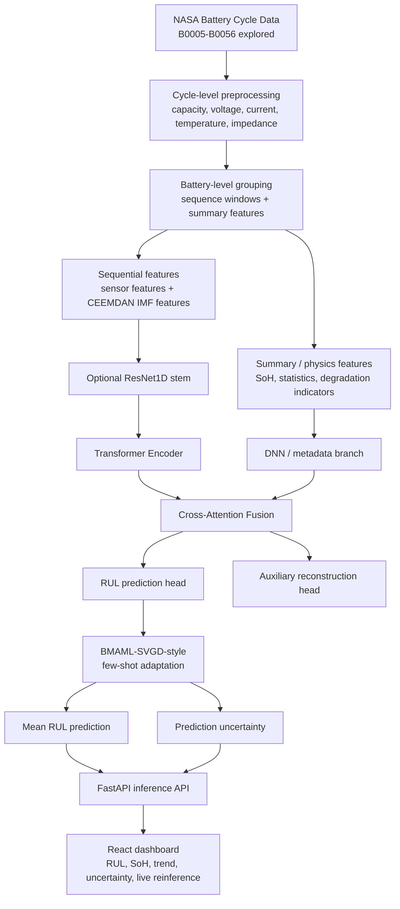
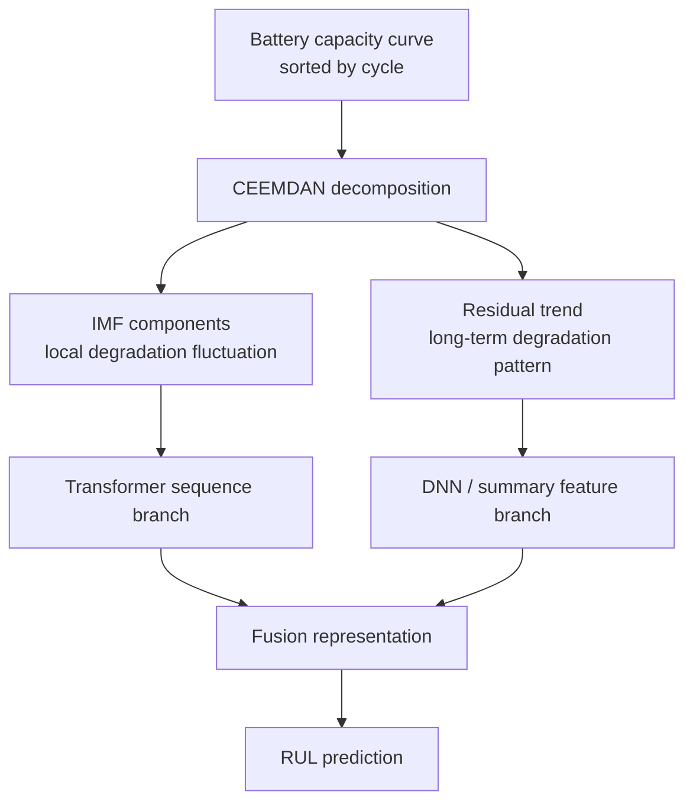
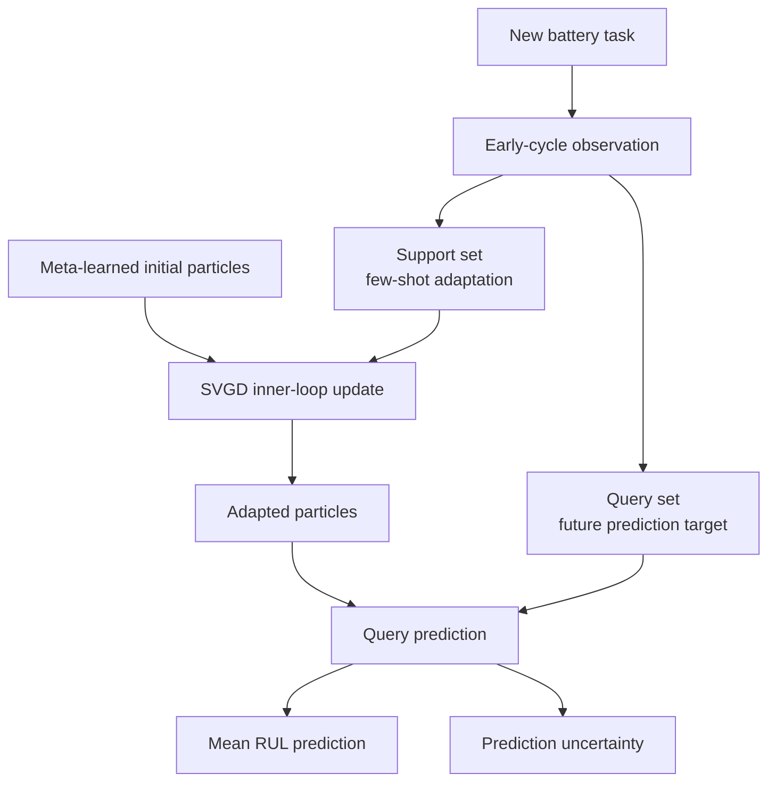
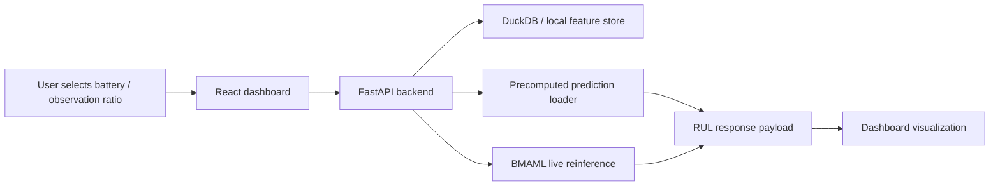

# Battery RUL AI Inference System

Language: [English](README.md) | 한국어

리튬이온 배터리 잔여수명(RUL, Remaining Useful Life) 예측, 불확실성 시각화, 열화 모니터링, live reinference를 제공하는 딥러닝 기반 AI inference application입니다.

이 프로젝트는 하나의 모델링 질문에서 출발했습니다. **배터리별 열화 패턴과 실험 조건이 다르더라도, 초기 일부 cycle 관측값만으로 이후의 긴 RUL 궤적을 예측할 수 있을까?**  
최종 시스템은 CEEMDAN 기반 신호 분해, Transformer/DNN 표현 학습, BMAML-SVGD-style few-shot adaptation, FastAPI inference API, React 대시보드를 연결합니다.

**Live Demo**: https://onekindalpha-battery-rul-dashboard-bmaml-svgd.hf.space  
**Demo Video**: https://github.com/user-attachments/assets/1e05d64d-b9e3-47ac-abc4-06048ae3b7a7  
**Related RAG Copilot**: https://github.com/onekindalpha/battery-technical-document-rag

[](https://github.com/user-attachments/assets/1e05d64d-b9e3-47ac-abc4-06048ae3b7a7)

데모는 cycle 단위 RUL 추론, 열화 모니터링, 배터리 비교, EOL 이전 anomaly evidence 기반 설명 가능성 분석, SHAP 기반 feature importance, live reinference 흐름을 보여줍니다.

---

## Service Overview

배터리 열화는 균일하지 않습니다. NASA Battery Dataset 안에서도 배터리별 cycle 길이, 실험 조건, 온도 프로파일, 임피던스 변화, 열화 궤적이 서로 다릅니다. 이 프로젝트는 이러한 차이를 확인하고, 정상 열화와 급격한 열화 사례를 함께 점검할 수 있는 inference application을 구현합니다.

대시보드는 단순한 예측 점수만 보여주는 것이 아니라 다음 정보를 함께 제공합니다.

- 초기 cycle 관측 구간 기반 RUL 예측
- SoH 및 degradation trend 시각화
- particle-based adaptation 기반 uncertainty band
- B0018, B0043 등 대표 test battery 비교
- 빠른 데모 접근을 위한 precomputed prediction loading
- 사용자가 직접 재추론할 수 있는 live reinference
- feature importance / explainability view
- 현재 예측 결과 CSV export

---

## Modeling Architecture



---

## Why CEEMDAN + Transformer/DNN

배터리 capacity degradation은 하나의 매끄러운 선이 아닙니다. 국소적인 변동, capacity regeneration-like behavior, 장기 열화 추세가 함께 섞여 있습니다. 이 프로젝트는 sequence modeling 이전에 CEEMDAN decomposition으로 신호를 분리합니다.



Implementation notes:

- CEEMDAN preprocessing은 battery 단위로 수행했습니다.
- IMF feature는 sequence branch에 추가했습니다.
- residual/trend와 engineered degradation feature는 summary branch와 함께 사용했습니다.
- capacity만 사용하지 않고 sensor, capacity, impedance, derived degradation feature를 함께 반영했습니다.

---

## Why BMAML-SVGD

새롭게 모니터링되는 배터리는 전체 수명 궤적을 처음부터 가지고 있지 않습니다. Meta-learning 단계는 이 운영 제약을 기준으로 설계했습니다. 초기 일부 cycle support window에서 빠르게 적응한 뒤, query window의 미래 RUL behavior를 예측하는 구조입니다.



BMAML-SVGD-style 단계는 여러 parameter particle을 유지하고, support set에서 adaptation을 수행한 뒤 prediction spread를 uncertainty estimate로 사용합니다. 대시보드에서는 이 결과가 단일 point estimate가 아니라 uncertainty band로 표시됩니다.

---

## Final Checkpoint Split

프로젝트 초기에는 NASA battery range와 여러 degradation group을 폭넓게 탐색했습니다. 최종 BMAML checkpoint는 다음 battery-level split을 사용합니다.

| Split | Batteries |
| --- | --- |
| Train | B0054, B0046, B0005, B0044, B0034, B0007, B0006 |
| Validation | B0055, B0033 |
| Test | B0043, B0048, B0018, B0042 |

Key setting snapshot:

| Item | Value |
| --- | --- |
| Dataset source | NASA Battery Dataset |
| Feature columns | 40 |
| Support samples | k_shot = 16 |
| Query samples | q_query = 16 |
| Particles | 3 |
| RUL scaling | minmax |
| Representative metric | RMSE 7.46 cycles, MAE 6.82 cycles |

해당 split은 row-level random split이 아니라 battery-based split입니다. Dashboard에서 B0018은 정상 열화 test battery 사례로, B0043은 더 급격한 열화 패턴을 확인하는 test battery 사례로 활용할 수 있습니다.

---

## Training Optimization

초기 실험에서는 epoch을 늘린다고 항상 성능이 개선되지 않았고, 일부 run은 RMSE plateau에 머무르는 문제가 있었습니다. 여러 설정을 빠르게 탐색하기 위해 Ray Tune으로 CPU/GPU resource를 나누어 trial을 실행했고, ASHA scheduler로 성능이 낮은 trial을 조기에 중단했습니다.

이 과정을 통해 final BMAML-SVGD-style checkpoint 이전의 수동 trial-and-error를 줄였습니다.

---

## Application Flow



Inference manager는 먼저 precomputed result가 있는지 확인합니다. 사용자가 live reinference를 요청하면 backend가 BMAML inference path를 실행하고, 업데이트된 prediction data를 dashboard로 반환합니다.

---

## Dashboard Features

- **Overview**: RUL prediction curve, support/query split, uncertainty band, metrics
- **Degradation**: capacity, DCR, impedance, temperature, current stress, proxy degradation signal
- **Compare**: multi-battery comparison view
- **Explainability**: uncertainty summary, anomaly evidence, SHAP-based feature importance, model architecture
- **Live Reinference**: user-triggered inference flow와 updated dashboard state
- **Export**: 현재 표시 중인 prediction curve CSV download

---

## Methodological Background

이 프로젝트는 하나의 논문을 그대로 재현하기보다, feature selection, decomposition-based modeling, early-cycle prediction, uncertainty-aware adaptation의 설계 방향을 정하기 위해 아래 연구들을 참고했습니다.

| Paper / study | How it informed this project |
| --- | --- |
| *Lithium-ion battery aging dataset based on electric vehicle real-driving profiles* | capacity, temperature, impedance, resistance, usage pattern을 operational degradation signal로 해석하는 데 참고했습니다. |
| *Predicting the impact of formation protocols on battery lifetime immediately after manufacturing* | early diagnostic signal과 resistance-related feature가 long-term lifetime prediction에 중요하다는 점을 참고했습니다. |
| *Early prediction of remaining useful life for lithium-ion batteries based on CEEMDAN-transformer-DNN hybrid model* | capacity degradation을 IMF component와 residual trend로 분해한 뒤 sequence modeling에 연결하는 backbone 아이디어로 활용했습니다. |
| *Few-shot remaining useful life prediction based on Bayesian meta-learning with predictive uncertainty calibration* | 제한된 early-cycle observation으로 새로운 degradation task에 적응하고 predictive uncertainty를 표현하는 방향을 참고했습니다. |

최종 구현은 위 방법론들을 FastAPI/React inference application과 연결해, 모델 결과를 운영 대시보드 형태로 점검할 수 있게 만든 것입니다.

---

## Tech Stack

| Area | Stack |
| --- | --- |
| Modeling | Python, PyTorch, CEEMDAN, Transformer, DNN, BMAML-SVGD-style adaptation |
| Data | NASA Battery Dataset, Pandas, NumPy, DuckDB, CSV/Parquet feature tables |
| Backend | FastAPI, inference manager, precomputed result loader, DuckDB-backed feature access |
| Frontend | React, Vite, TailwindCSS, Plotly.js |
| Deployment | Docker, Hugging Face Spaces, Git LFS |
| Explainability | SHAP-based feature importance |

---

## Repository Map


위 diagram은 repository tree 전체를 길게 나열하는 대신, 주요 구현 진입점을 요약합니다.

---

## Local Development

```bash
# Backend
cd backend
uvicorn main:app --reload
```

```bash
# Frontend
cd frontend
npm install
npm run dev
```

```bash
# Live reinference example
python run_bmaml_reinfer.py --battery B0043 --checkpoint ../core_checkpoints/nasa_bmaml_best_re.pt --r_ratio 0.2
```

Local checkpoint와 data 위치에 따라 path는 달라질 수 있습니다. Public demo는 안정적인 dashboard loading을 위해 prepared assets와 precomputed prediction file을 사용합니다.

---

## Deployment

이 프로젝트는 Docker 기반 Hugging Face Spaces에 배포했습니다.

Deployment notes:

- Docker가 full-stack app을 build하고 serving합니다.
- Git LFS로 model checkpoint file을 관리합니다.
- Precomputed cache로 initial dashboard loading speed를 개선합니다.
- Live reinference는 on-demand path로 실행할 수 있습니다.

```bash
git push hf main
```

---

## Limitations & Future Work

이 프로젝트는 production BMS system이 아니라 portfolio-level AI inference application입니다. 현재 구현은 NASA battery data와 selected battery-level evaluation scenario를 기반으로 합니다.

Future work:

- NASA 외 추가 battery dataset으로 검증 확장
- stronger domain shift 상황에서 uncertainty calibration 개선
- RAG research copilot과 experiment log / model card 연결
- prediction drift와 data quality check를 위한 model monitoring view 추가
- production-like deployment를 위한 live inference runtime 최적화

---

## License

MIT License

---

## Author

**onekindalpha** — AI/Data Application Developer Portfolio

- Data pipeline: feature engineering, few-shot task construction, robust scaling
- Deep learning: BMAML-SVGD-style adaptation, CEEMDAN-Transformer-DNN backbone, uncertainty estimation
- Backend: FastAPI, DuckDB-backed feature access, inference APIs, degradation monitoring
- Frontend: React dashboard, visualization, live reinference state management
- Deployment: Docker, Hugging Face Spaces, Git LFS

---

## Links

- **Live Demo**: https://onekindalpha-battery-rul-dashboard-bmaml-svgd.hf.space
- **Demo Video**: https://github.com/user-attachments/assets/1e05d64d-b9e3-47ac-abc4-06048ae3b7a7
- **Related RAG Copilot**: https://github.com/onekindalpha/battery-technical-document-rag
