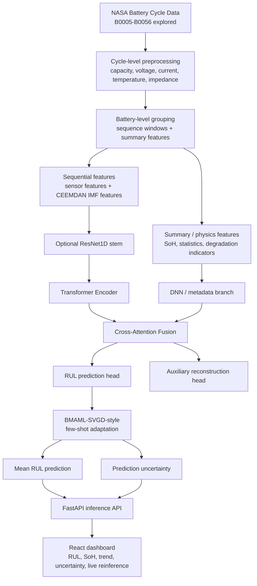
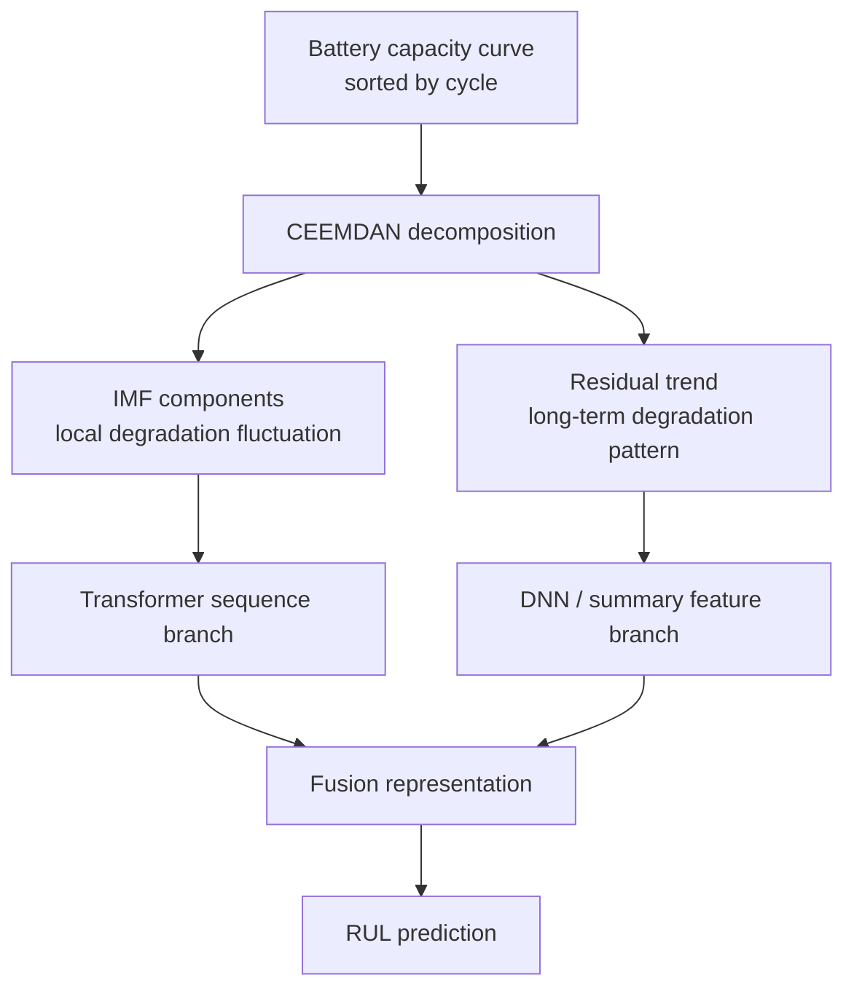
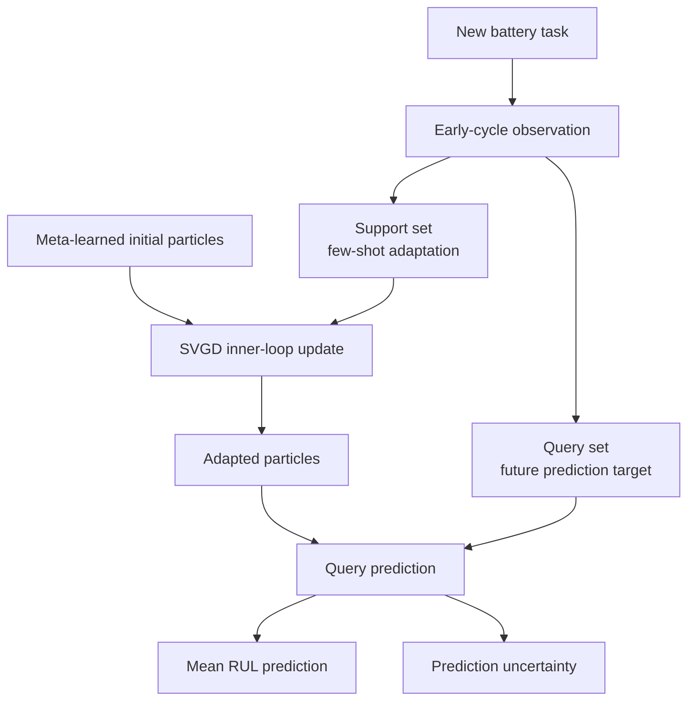
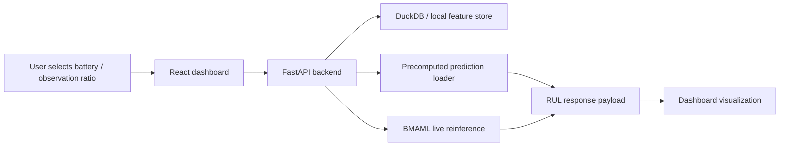

# Battery RUL AI Inference System

Language: English | [한국어](README.ko.md)

Deep learning-based AI inference application for lithium-ion battery remaining useful life (RUL) prediction, uncertainty visualization, degradation monitoring, and live reinference.

This project started from a modeling question: **can a battery RUL model make useful long-range predictions from only early-cycle observations, even when batteries show different degradation patterns?**  
The final system connects CEEMDAN-based signal decomposition, Transformer/DNN representation learning, BMAML-SVGD-style few-shot adaptation, FastAPI inference APIs, and a React dashboard.

**Live Demo**: https://onekindalpha-battery-rul-dashboard-bmaml-svgd.hf.space  
**Demo Video**: https://github.com/user-attachments/assets/1e05d64d-b9e3-47ac-abc4-06048ae3b7a7  
**Related RAG Copilot**: https://github.com/onekindalpha/battery-technical-document-rag

[](https://github.com/user-attachments/assets/1e05d64d-b9e3-47ac-abc4-06048ae3b7a7)

The demo shows cycle-level RUL inference, degradation monitoring, battery comparison, explainability with pre-EOL anomaly evidence, SHAP-based feature importance, and live reinference.

---

## Service Overview

Battery degradation is not uniform. Even within the NASA battery dataset, batteries differ by cycle length, experimental condition, temperature profile, impedance behavior, and degradation trajectory. This project explores those differences and builds an inference application that can inspect both normal degradation and steeper degradation cases.

The dashboard is designed to show more than a final prediction score:

- RUL prediction from early-cycle observation windows
- SoH and degradation trend visualization
- uncertainty band from particle-based adaptation
- comparison between representative test batteries such as B0018 and B0043
- precomputed prediction loading for fast demo access
- optional live reinference for recomputing model output
- feature importance / explainability views
- CSV export for the currently displayed prediction result

---

## Modeling Architecture



---

## Why CEEMDAN + Transformer/DNN

Capacity degradation is not a single smooth line. It includes local fluctuation, regeneration-like behavior, and long-term aging trend. The project uses CEEMDAN decomposition to separate those signals before sequence modeling.



Implementation notes:

- CEEMDAN preprocessing is performed at battery level.
- IMF features are added to the sequence branch.
- Residual/trend and engineered degradation features are used with the summary branch.
- The model uses sensor, capacity, impedance, and derived degradation features rather than capacity alone.

---

## Why BMAML-SVGD

A newly monitored battery does not come with its full lifetime trajectory. The meta-learning stage was designed around that operational constraint: adapt from a small early-cycle support window, then predict future RUL behavior through a query window.



The BMAML-SVGD-style stage keeps multiple parameter particles, adapts them on the support set, and uses their prediction spread as an uncertainty estimate. In the dashboard, this appears as an uncertainty band instead of a single point estimate.

---

## Final Checkpoint Split

The project initially explored a wider NASA battery range and several degradation groups. The final BMAML checkpoint uses the following battery-level split:

| Split | Batteries |
| --- | --- |
| Train | B0054, B0046, B0005, B0044, B0034, B0007, B0006 |
| Validation | B0055, B0033 |
| Test | B0043, B0048, B0018, B0042 |

Key setting snapshot:

| Item | Value |
| --- | --- |
| Dataset source | NASA Battery Dataset |
| Feature columns | 40 |
| Support samples | k_shot = 16 |
| Query samples | q_query = 16 |
| Particles | 3 |
| RUL scaling | minmax |
| Representative metric | RMSE 7.46 cycles, MAE 6.82 cycles |

The split is battery-based, so the test batteries are evaluated as separate battery tasks rather than row-level random samples. In the dashboard, B0018 is useful as a representative normal-degradation test battery, while B0043 is useful for inspecting a steeper degradation pattern.

---

## Training Optimization

Early experiments showed that longer training did not always improve the model. Some runs stayed near an RMSE plateau even after many epochs. To search model settings faster, Ray Tune was used to run multiple trials across available CPU/GPU resources, and ASHA was used to stop weak trials early.

This tuning process reduced manual trial-and-error before the final BMAML-SVGD-style checkpoint.

---

## Application Flow



The inference manager first checks whether a precomputed result is available. If the user requests live reinference, the backend runs the BMAML inference path and returns updated prediction data to the dashboard.

---

## Dashboard Features

- **Overview**: RUL prediction curve, support/query split, uncertainty band, and metrics
- **Degradation**: capacity, DCR, impedance, temperature, current stress, and proxy degradation signals
- **Compare**: multi-battery comparison view
- **Explainability**: uncertainty summary, anomaly evidence, SHAP-based feature importance, and model architecture
- **Live Reinference**: user-triggered inference flow with updated dashboard state
- **Export**: CSV download for the currently displayed prediction curve

---

## Methodological Background

This project was not designed as a direct reproduction of a single paper. The papers were used as design references for feature selection, decomposition-based modeling, early-cycle prediction, and uncertainty-aware adaptation.

| Paper / study | How it informed this project |
| --- | --- |
| *Lithium-ion battery aging dataset based on electric vehicle real-driving profiles* | Treated capacity, temperature, impedance, resistance, and usage pattern as operational degradation signals rather than relying only on capacity. |
| *Predicting the impact of formation protocols on battery lifetime immediately after manufacturing* | Reinforced the importance of early diagnostic signals and resistance-related features for long-term lifetime prediction. |
| *Early prediction of remaining useful life for lithium-ion batteries based on CEEMDAN-transformer-DNN hybrid model* | Used as the backbone idea for decomposing capacity degradation into IMF components and residual trend before sequence modeling. |
| *Few-shot remaining useful life prediction based on Bayesian meta-learning with predictive uncertainty calibration* | Used as a reference for adapting to a new degradation task with limited early-cycle observations and representing predictive uncertainty. |

The final implementation combines these ideas with a FastAPI/React inference application so the model output can be inspected as an operational dashboard.

---

## Tech Stack

| Area | Stack |
| --- | --- |
| Modeling | Python, PyTorch, CEEMDAN, Transformer, DNN, BMAML-SVGD-style adaptation |
| Data | NASA Battery Dataset, Pandas, NumPy, DuckDB, CSV/Parquet feature tables |
| Backend | FastAPI, inference manager, precomputed result loader, DuckDB-backed feature access |
| Frontend | React, Vite, TailwindCSS, Plotly.js |
| Deployment | Docker, Hugging Face Spaces, Git LFS |
| Explainability | SHAP-based feature importance |

---

## Repository Map


The diagram above highlights the main implementation entry points without listing every file in the repository tree.

---

## Local Development

```bash
# Backend
cd backend
uvicorn main:app --reload
```

```bash
# Frontend
cd frontend
npm install
npm run dev
```

```bash
# Live reinference example
python run_bmaml_reinfer.py --battery B0043 --checkpoint ../core_checkpoints/nasa_bmaml_best_re.pt --r_ratio 0.2
```

Paths may vary depending on local checkpoint and data locations. The public demo uses prepared assets and precomputed prediction files for stable dashboard loading.

---

## Deployment

This project is deployed on Hugging Face Spaces using Docker.

Deployment notes:

- Docker builds and serves the full-stack app.
- Git LFS tracks model checkpoint files.
- Precomputed cache improves initial dashboard loading speed.
- Live reinference is available as an on-demand path in the demo environment.

```bash
git push hf main
```

---

## Limitations & Future Work

This is a portfolio-level AI inference application, not a production BMS system. The current implementation is based on NASA battery data and selected battery-level evaluation scenarios.

Future work:

- validate with additional battery datasets beyond NASA
- improve uncertainty calibration under stronger domain shift
- connect the RAG research copilot with experiment logs and model cards
- add model monitoring views for prediction drift and data quality checks
- optimize live inference runtime for production-like deployment

---

## License

MIT License

---

## Author

**onekindalpha** — AI/Data Application Developer Portfolio

- Data pipeline: feature engineering, few-shot task construction, robust scaling
- Deep learning: BMAML-SVGD-style adaptation, CEEMDAN-Transformer-DNN backbone, uncertainty estimation
- Backend: FastAPI, DuckDB-backed feature access, inference APIs, degradation monitoring
- Frontend: React dashboard, visualization, live reinference state management
- Deployment: Docker, Hugging Face Spaces, Git LFS

---

## Links

- **Live Demo**: https://onekindalpha-battery-rul-dashboard-bmaml-svgd.hf.space
- **Demo Video**: https://github.com/user-attachments/assets/1e05d64d-b9e3-47ac-abc4-06048ae3b7a7
- **Related RAG Copilot**: https://github.com/onekindalpha/battery-technical-document-rag
