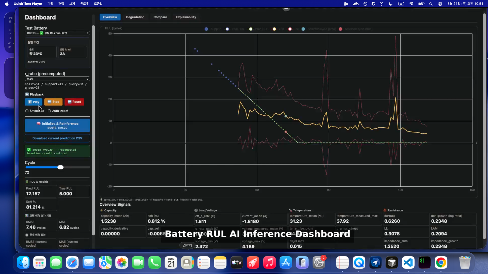
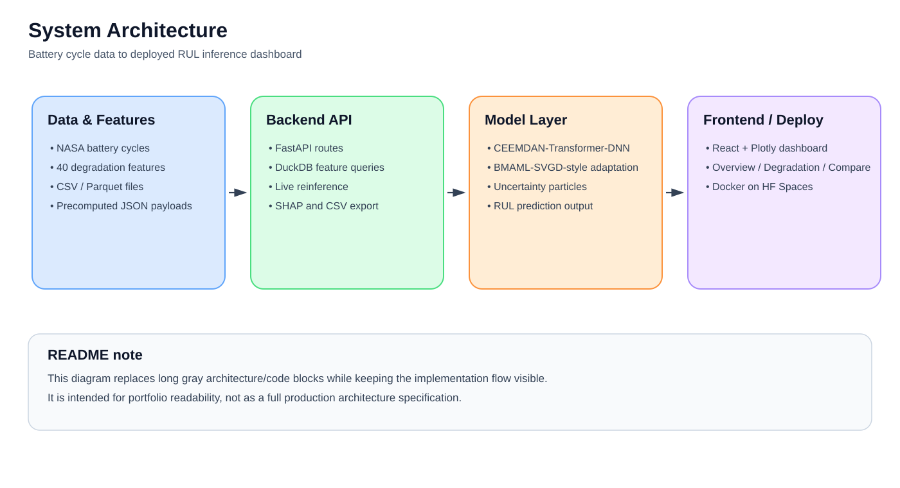
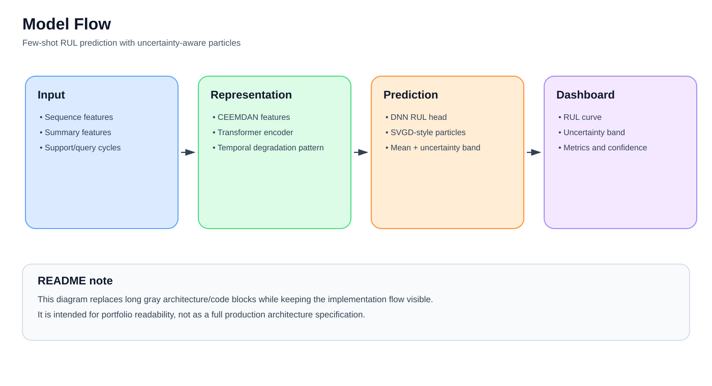
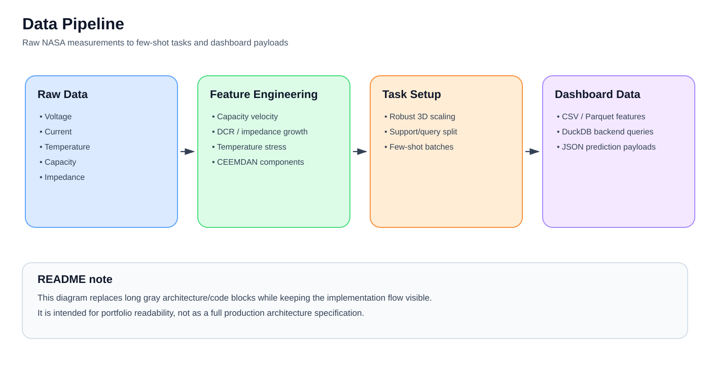
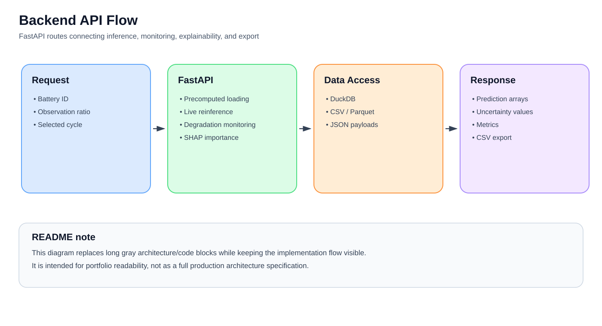
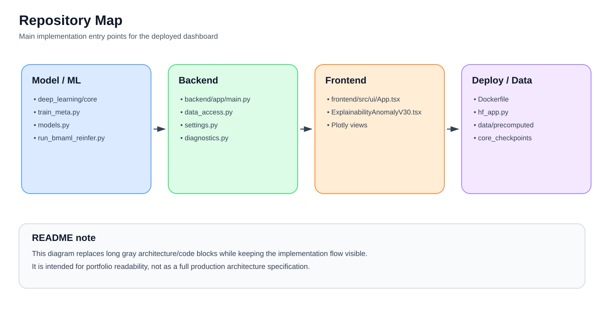

# Battery RUL AI Inference System

Language: English | [한국어](README.ko.md)


Deep learning-based full-stack AI inference system for battery remaining useful life (RUL) prediction, live reinference, degradation monitoring, and explainability.

**Goal**: Build an end-to-end AI inference system that predicts battery RUL from early-cycle observations and visualizes degradation signals through a web dashboard.

**Live Demo**: https://onekindalpha-battery-rul-dashboard-bmaml-svgd.hf.space  
**Demo Video**: https://github.com/user-attachments/assets/1e05d64d-b9e3-47ac-abc4-06048ae3b7a7

[](https://github.com/user-attachments/assets/1e05d64d-b9e3-47ac-abc4-06048ae3b7a7)

The demo shows cycle-level RUL inference, degradation monitoring, battery comparison, explainability with pre-EOL anomaly evidence, SHAP-based feature importance, and live reinference.

---

## TL;DR

- Built an end-to-end deep learning inference system for NASA battery RUL prediction and degradation monitoring.
- Designed domain-informed time-series features and few-shot support/query tasks from battery cycle data.
- Implemented BMAML-SVGD-style uncertainty-aware meta-learning with a CEEMDAN-Transformer-DNN backbone.
- Built and deployed a FastAPI + React dashboard with live reinference, uncertainty visualization, degradation monitoring, SHAP-based explainability, precomputed baseline restoration, and frontend CSV download.
- Used DuckDB-backed local feature data access with CSV/Parquet support and local JSON prediction payloads for dashboard loading and precomputed inference results.

---

## Project Overview

This project connects battery domain features, sequence modeling, inference APIs, and a deployable web dashboard.

- **Problem**: Predict battery remaining useful life from early-cycle observations and monitor degradation behavior.
- **Data Pipeline**: NASA battery cycle data → domain-informed feature engineering → few-shot support/query task construction.
- **Modeling**: BMAML-SVGD-style few-shot Bayesian meta-learning with a CEEMDAN-Transformer-DNN backbone.
- **Inference System**: PyTorch model inference with precomputed cache and optional live reinference.
- **Application**: FastAPI backend + React/Vite dashboard deployed with Docker on Hugging Face Spaces.

---

## My Role

I implemented the core pipeline from data preprocessing to model inference, dashboard development, and deployment.

- **Data / Feature Engineering**: NASA battery preprocessing, 40 time-series features, support/query task construction, and robust scaling.
- **Deep Learning**: BMAML-SVGD-style meta-learning, CEEMDAN-Transformer-DNN backbone, and uncertainty estimation.
- **Backend**: FastAPI inference APIs, DuckDB-backed local feature data access with CSV/Parquet support, degradation monitoring endpoints, and precomputed/live inference result handling.
- **Frontend**: React dashboard, RUL curve visualization, uncertainty band rendering, degradation tabs, and live reinference state management.
- **Deployment**: Dockerized full-stack app deployment on Hugging Face Spaces with Git LFS checkpoint handling.

---

## Key Features

### RUL Prediction Dashboard

- Visualizes predicted RUL trajectory from the support period to the query period.
- Displays prediction curves, ground-truth references, and model uncertainty bands.
- Calculates RMSE, MAE, and confidence-related metrics for selected batteries and observation ratios.

### Live Reinference

- Provides an `Initialize & Reinference` flow for on-demand model inference.
- Runs CPU-based reinference in the deployed Hugging Face Spaces environment.
- Updates prediction curves, uncertainty values, confidence metrics, and dashboard state after reinference.
- Allows users to restore the precomputed baseline result after live reinference.
- Allows users to download the currently displayed prediction curve as a CSV file.

### Degradation Monitoring

- Monitors degradation-related signals such as capacity, DCR, impedance, temperature, current stress, and LLI proxy signals.
- Uses cycle-level evidence to identify abnormal degradation behavior.
- Provides a degradation-focused view beyond a single RUL prediction number.

### Explainability & Uncertainty

- Estimates prediction uncertainty using multiple SVGD-style prediction particles.
- Visualizes global feature importance through SHAP-based analysis.
- Connects model output with degradation-related feature behavior.

### Deployment-Oriented Inference Flow

- Uses precomputed prediction cache for fast initial loading.
- Supports live reinference when deeper analysis is needed.
- Handles local and Docker/Hugging Face runtime path differences through deployment-aware configuration.

---

## System Architecture



The deployed dashboard has two inference paths. The fast path loads precomputed JSON payloads for the selected battery and observation ratio. The optional live path runs the PyTorch reinference wrapper and updates the dashboard with live prediction and uncertainty values.

The same FastAPI backend serves degradation monitoring, SHAP feature importance, CSV export, and DuckDB-backed feature access. The React frontend renders the prediction, monitoring, comparison, explainability, playback, baseline restore, and export flows.

---

## Deep Learning Approach

### Few-Shot RUL Prediction

In real battery operation, long-term degradation data may not be available at the beginning of a battery's life. This project frames early-cycle RUL estimation as a few-shot prediction problem.

- **Support set**: early observed cycles
- **Query set**: future cycles to predict
- **Task**: adapt to each battery using limited early-cycle information

### BMAML-SVGD-Style Meta-Learning



The model is inspired by Bayesian MAML and SVGD-based uncertainty estimation. It uses sequence features and summary features, CEEMDAN-based decomposition features, a Transformer encoder, a DNN prediction head, and SVGD-style particles for uncertainty-aware RUL prediction.

### Why This Approach

- **Few-shot adaptation** helps model new batteries from limited early-cycle observations.
- **Sequence modeling** captures degradation patterns across time.
- **Uncertainty estimation** provides more information than a single point prediction.
- **Domain-informed features** connect ML predictions with physical degradation behavior.

---

## Data Pipeline



Raw battery measurements are transformed into degradation-related time-series features. These features include capacity degradation velocity, DCR/impedance growth rate, temperature stress indicators, current/load stress metrics, CEEMDAN-based IMF decomposition features, and LLI/LAM proxy signals.

Main data components:

- **Feature count**: 40 time-series features
- **Scaling**: custom robust 3D scaling for sequence data
- **Task setup**: support/query construction for meta-learning
- **Data access**: DuckDB-backed local CSV/Parquet querying and JSON prediction payload loading in the backend

---

## Model & Training

### Model Components

- **Backbone**: CEEMDAN-Transformer-DNN
- **Meta-learning**: BMAML-SVGD-style few-shot adaptation
- **Uncertainty**: particle-style prediction distribution
- **Tuning**: Ray Tune + ASHA scheduler
- **Checkpoint**: `nasa_bmaml_best_re.pt`

### Experimental Setting

- **Support Set**: 16 cycles
- **Query Set**: 16 cycles
- **Meta-Train Batteries**: 14 batteries
- **Meta-Val Batteries**: 2 batteries
- **Meta-Test Batteries**: 6 batteries
- **Evaluation Ratio**: r_ratio = 0.20

### Training Results

- **RMSE**: 7.46 cycles at r_ratio = 0.20
- **MAE**: 6.82 cycles at r_ratio = 0.20

> These results validate the implemented inference pipeline under a fixed experimental setting. They are not presented as a state-of-the-art benchmark claim.

---

## Engineering Challenges Solved

### Local vs Docker Path Mismatch

**Problem**: Model checkpoints and data files worked locally but failed inside Docker/Hugging Face Spaces due to different runtime paths.

**Solution**: Added deployment-aware path handling through backend settings and runtime entrypoints.

### CPU-Based Live Reinference Runtime

**Problem**: Live reinference takes around 40 seconds in a CPU-only Hugging Face Spaces environment.

**Solution**: Combined precomputed JSON cache for fast initial loading with on-demand live reinference for detailed analysis.

### Frontend-Backend State Synchronization

**Problem**: Reinference results needed to update prediction curves, uncertainty bands, confidence values, metrics, baseline restoration, and dashboard state consistently.

**Solution**: Designed API response payloads and React state flow to synchronize prediction, standard deviation, confidence, and metrics.

### Backend 500 Errors and Deployment Stability

**Problem**: Missing files, path mismatches, or unavailable precomputed data could break the dashboard flow.

**Solution**: Added fallback behavior, diagnostics, and deployment-aware file handling to improve runtime stability.

### Model Output to User-Facing Dashboard

**Problem**: Raw model outputs are difficult to interpret directly.

**Solution**: Converted predictions into visual curves, uncertainty bands, degradation indicators, SHAP feature importance, and frontend CSV download for the currently displayed prediction curve.

---

## Backend API



The backend is implemented with FastAPI and provides inference, degradation monitoring, explainability, and export endpoints.

Main endpoint groups:

- precomputed prediction loading
- live reinference
- degradation monitoring
- SHAP-based feature importance
- CSV export for the current prediction result

Backend responsibilities:

- Load precomputed prediction payloads.
- Run live model reinference.
- Query local CSV/Parquet feature data through DuckDB.
- Load JSON prediction payloads for precomputed inference results.
- Generate degradation monitoring outputs.
- Provide SHAP-based feature importance results.

---

## Frontend Dashboard

The frontend is implemented with React, Vite, TailwindCSS, and Plotly.js.

Main views:

- **Overview**: RUL prediction curve, support/query split, uncertainty band, and metrics.
- **Degradation**: capacity, DCR, impedance, temperature, current stress, and proxy degradation signals.
- **Compare**: multi-battery comparison view.
- **Explainability**: uncertainty summary, cumulative anomaly evidence, SHAP-based feature importance, and model architecture.
- **Live Reinference**: user-triggered inference flow with updated dashboard state.

---

## Tech Stack

- **Deep Learning**: PyTorch
- **Meta-Learning**: BMAML-SVGD-style few-shot learning
- **Sequence Modeling**: CEEMDAN + Transformer + DNN
- **Signal Processing**: CEEMDAN, robust scaling
- **Feature Engineering**: 40 time-series degradation features
- **Hyperparameter Tuning**: Ray Tune, ASHA scheduler
- **Backend**: FastAPI, DuckDB-backed local feature data access with CSV/Parquet support
- **Frontend**: React, Vite, TailwindCSS, Plotly.js
- **Deployment**: Docker, Hugging Face Spaces, Git LFS
- **Explainability**: SHAP-based feature importance

---

## Repository Map



The diagram above highlights the main implementation entry points without listing every file in the repository tree.

---

## Local Development

### Create Environment

```bash
conda create -n battery-maml python=3.10
conda activate battery-maml
```

### Install Backend

```bash
pip install -e ./backend
```

### Install ML Dependencies

```bash
pip install torch==2.2.2 torchvision==0.17.2 torchaudio==2.2.2
pip install ray[tune]==2.20.0
pip install pyyaml
```

### Install Frontend

```bash
cd frontend
npm install
npm run dev
```

---

## Model Training

```bash
cd deep_learning/core
python train_meta.py --config config.yaml   --k_shot 30   --q_query 128   --meta_lr 0.001   --inner_lr 0.01
```

---

## Live Inference

```bash
python run_bmaml_reinfer.py   --battery B0043   --checkpoint ../core_checkpoints/nasa_bmaml_best_re.pt   --r_ratio 0.2
```

---

## Deployment

This project is deployed on Hugging Face Spaces using Docker.

Deployment notes:

- **Docker**: builds and serves the full-stack app.
- **Git LFS**: tracks model checkpoint files.
- **Dynamic Paths**: handles local vs Docker/HF runtime paths.
- **Precomputed Cache**: improves initial dashboard loading speed.
- **Live Reinference Timeout**: configured to allow long CPU-based inference requests.

```bash
git push hf main
```

---

## Limitations & Future Work

- **Dataset**: currently focused on the NASA battery dataset. Future work could add CALCE or real-world EV battery data.
- **Inference**: live reinference is CPU-based in the deployed demo. Future work could use GPU-backed cloud inference or an optimized runtime.
- **Monitoring**: current diagnostics are dashboard-oriented. Future work could add structured logging and model monitoring.
- **Experiment Tracking**: experiment metadata is limited. Future work could integrate W&B or MLflow consistently.
- **Testing**: validation is mostly manual. Future work could add API tests, inference regression tests, and frontend flow tests.
- **Code Structure**: some backend/frontend modules are large. Future work could modularize FastAPI routers and React components.
- **Model Optimization**: current inference uses a full checkpoint. Future work could explore quantization or distilled inference models.

---

## Methodological Background

This project is methodologically inspired by MAML, Bayesian meta-learning, SVGD, and CEEMDAN-based signal decomposition.

Rather than claiming a full reproduction of each original method, the implementation uses BMAML-SVGD-style few-shot adaptation and uncertainty estimation on top of CEEMDAN-Transformer-DNN degradation modeling.

- Finn et al. (2017), Model-Agnostic Meta-Learning (MAML): used as the conceptual basis for few-shot adaptation.
- Bayesian MAML / Bayesian meta-learning: used as the motivation for uncertainty-aware meta-learning and particle-based prediction.
- Liu & Wang (2016), Stein Variational Gradient Descent (SVGD): used as the basis for particle-style Bayesian uncertainty estimation.
- Torres et al. (2011), CEEMDAN: used as the signal decomposition background for separating local capacity fluctuation/regeneration components from long-term degradation trends.

---

## License

MIT License

---

## Author

**onekindalpha** — Full-stack AI / Deep Learning Engineer

- Data pipeline: feature engineering, few-shot task construction, robust scaling
- Deep learning: BMAML-SVGD-style adaptation, CEEMDAN-Transformer-DNN backbone, uncertainty estimation
- Backend: FastAPI, DuckDB-backed local feature data access with CSV/Parquet support, inference APIs, degradation monitoring
- Frontend: React dashboard, visualization, live reinference state management
- Deployment: Docker, Hugging Face Spaces, Git LFS

---

## Links

- **Live Demo**: https://onekindalpha-battery-rul-dashboard-bmaml-svgd.hf.space
- **Demo Video**: https://github.com/user-attachments/assets/1e05d64d-b9e3-47ac-abc4-06048ae3b7a7
